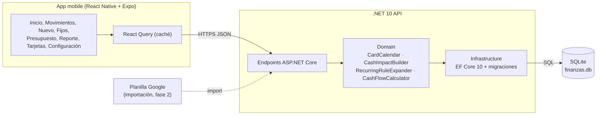

# Arquitectura

La app mobile solo muestra y carga datos; la API .NET calcula caja, cuotas y proyecciones con las reglas de la planilla.

## Reglas que implementa `Finanzas.Domain`

| Regla | Dónde |
| --- | --- |
| La compra con tarjeta va al resumen del primer cierre igual o posterior a la fecha de compra | `CardCalendar.ProposeDueDate` |
| Compra en N cuotas = un movimiento y N impactos en caja; el resto del redondeo va en la primera | `CashImpactBuilder.Build` |
| Aporte a Memey y Retiro de Memey mueven plata entre cajas sin cambiar el total | `CashImpactBuilder.Build` |
| Gastos fijos con medio de pago, monto vigente por mes, previstos hasta diciembre | `RecurringRuleExpander` |
| Caja al corte = saldo inicial + realizados hasta la fecha de corte (hoy por defecto) | `CashFlowCalculator.CashAt` |
| Por tarjeta y vencimiento: el mayor entre modelado, resumen real y pago previsto, menos lo pagado | `CashFlowCalculator.ProjectedAt` |

## Datos

Montos en centavos (`long`), fechas `DateOnly`. Las proyecciones leen solo `CashImpact`. Cierres y vencimientos de tarjeta en `CardCycle`, uno por mes, editables desde Configuración.
