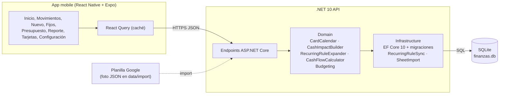

# Arquitectura

La app mobile solo muestra y carga datos; la API .NET calcula caja, cuotas y proyecciones con las reglas de la planilla.

## Reglas que implementa `Finanzas.Domain`

| Regla | Dónde |
| --- | --- |
| La compra con tarjeta va al resumen del primer cierre igual o posterior a la fecha de compra | `CardCalendar.ProposeDueDate` |
| Compra en N cuotas = un movimiento y N impactos en caja; el resto del redondeo va en la primera | `CashImpactBuilder.Build` |
| Aporte a Memey y Retiro de Memey mueven plata entre cajas sin cambiar el total | `CashImpactBuilder.Build` |
| Gastos fijos con medio de pago, monto vigente por mes, previstos hasta diciembre | `RecurringRuleExpander` |
| Caja al corte = saldo inicial + realizados hasta la fecha de corte (hoy por defecto) | `CashFlowCalculator.CashAt` |
| Por tarjeta y vencimiento: el mayor entre modelado, resumen real y pago previsto, menos lo pagado | `CashFlowCalculator.ProjectedAt` |
| El impacto en caja va a la caja del ámbito del movimiento (un gasto familiar pagado con Memey MP sale de la caja familiar) | `CashImpactBuilder.Build` |
| Consumo del presupuesto: gastos y cuota del auto realizados, con tarjeta el día de la compra; las cuotas anteriores a la apertura no consumen | `Budgeting.ConsumesBudget` |
| Proyección del mes: variables al ritmo diario, fijos y deuda el mayor entre presupuesto y real; alertas 70/80/100/120% | `Budgeting.Report` |
| Meses futuros: se descuenta el presupuesto no cubierto por gastos fijos cargados, el día 20 | `Budgeting.MonthlyEstimates` |
| Caja libre = proyectado a fin de mes menos cuotas de tarjeta ya compradas que vencen después | `CashFlowCalculator.CommittedCardInstallmentsAfter` |
| Al crear o cambiar un gasto fijo (o los cierres de su tarjeta) se regeneran sus previstos; los realizados no se tocan | `RecurringRuleSync` |

## Datos

Montos en centavos (`long`), fechas `DateOnly`. Las proyecciones leen solo `CashImpact`. Cierres y vencimientos de tarjeta en `CardCycle`, uno por mes, editables desde Configuración.

## Endpoints

Montos en pesos, fechas `yyyy-MM-dd`, meses `yyyy-MM`, enums en camelCase (`familia`, `pagoTarjeta`, `realizado`). `scope` acepta `familia`, `memey` o `total`.

| Método y ruta | Para qué |
| --- | --- |
| `GET /dashboard?scope&date` | Caja al corte (hoy por defecto), fin de mes, trimestral, caja libre, Memey, pagos de tarjeta por mes, alertas |
| `GET/POST /transactions`, `POST /transactions/{id}/confirm`, `DELETE /transactions/{id}` | Movimientos |
| `GET /cards/{id}/due-date?purchaseDate`, `GET/PUT /cards/{id}/cycles` | Vencimiento propuesto y cierres mes a mes |
| `GET/POST /recurring-rules`, `PUT/DELETE /recurring-rules/{id}` | Gastos fijos con monto vigente por mes |
| `GET/PUT /budgets/{month}` | Presupuesto mensual por categoría |
| `GET /reports/budget-vs-actual?month&cutoff&scope` | Presupuestado vs real con fecha de corte |
| `GET/PUT /settings`, `PUT /settings/cash-boxes/{id}` | Saldos iniciales, piso de caja y umbrales |
| `GET /people`, `GET /categories`, `GET /payment-methods` | Catálogos |
| `POST /import/sheet?replace` | Carga una foto de la planilla (`data/import`) |
